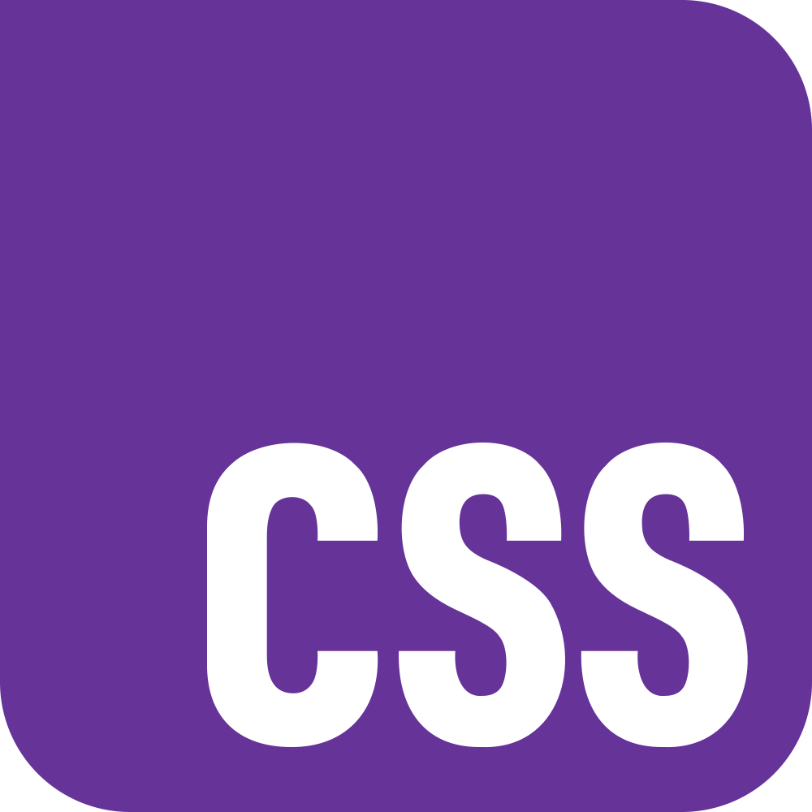

# 第1週：HTML 與 CSS 入門

## 網頁設計概論

### 吳林展

網頁設計出身 / 平面設計 / 開咖啡店 / 作雜誌
<seraphwu@mail.shu.edu.tw>

---

## 網頁設計介紹

### 需要軟體

**記事本**，甚至可以不需要

---

## 課程目標

本課程的具體目標如下：

1. 了解網頁內容的基本元件及應用方式。
2. 具備應用 HTML 設計網頁元件的技能。
3. 能夠以 CSS 設計各種網頁元件的外觀。
4. **具備閱讀 HTML + CSS code 的能力**。

---

## 授課方式

講授、實作

---

## 成績評定

- 期中作業(40%)
- 期末作業(40%)
- 出席與上課情形(20%)

---

## 永遠第一個 Hello World!

開啟命令列/終端機

### Windows

1. 按下 `Win` + `R`
2. 輸入 `cmd`
3. 按下 `Enter`

### Mac

1. 按下 `⌘/command` + `space`
2. 輸入 `terminal`
3. 按下 `Enter`

---

複製以下內容貼上 Windows 的命令列或 Mac 終端機

```
echo Hello World > index.html
```

按下 `Enter`

打開剛剛的位置，會有一個 `index.html`，雙擊打開它

---

## 重要觀念：路徑

詳細內容我們後面會再談

---

## 網頁設計概論

把網頁**設計**出來

> 每樣東西都是設計。每樣東西。Everything is design. Everything!
> — 保羅．蘭德

---

## 網頁設計需要考量

- 功能
- 外觀
- 易用性

---

### UI × UX

UI 講的是外觀（設計出什麼）
UX 講的是體驗（為什麼這麼設計）

---

## HTML 介紹


**HTML** (**H**yper**T**ext **M**arkup **L**anguage，超文本標記語言) 用來建立網頁的標記語言（但它不是程式語言）。由 **W3C** 維護，**目前版本為 HTML5**

---

## HTML 標記語法

HTML 標記語言，以 `< >` 包住標籤（及標籤屬性），標籤往往都是成對的，有開始就會相對應結束標籤 `</ >`。

例如標題 1 就是以 `<h1>` 開始，以 `</h1>` 結束，中間包的則是內容或是其他標籤構成的內容。

---

## 單一標籤（空元素）

少數標籤為單一存在，不需要關閉標籤，例如：

- `<hr>` 水平線
- `<br>` 強制換行
- `` 圖片
- `<input>` 表單輸入標籤
- `<link>` 連結（樣式表、JavaScript）
- `<meta>` metadata
- `<wbr>` 斷行（在縮放時需要斷行處斷行）

---

## CSS 介紹



**CSS** (**C**ascading **S**tyle **S**heets，串樣式列表、級聯樣式表、串接樣式表、階層式樣式表)

**目前版本為 CSS3**，由 CSS Next 專案社群共同提出

---

## HTML 與 CSS 的分工

| 項目 | 功能 |
| ---- | ---- |
| HTML | 內容文本 |
| CSS  | 外觀樣式 |

使用 HTML + CSS 的好處：**文本樣式分離**

---

## CSS Zen Garden

[CSS Zen Garden](https://csszengarden.com/) 呈現了**同樣**的文本（HTML），透過**不同**的 CSS 樣式表，可以變成**完全不同**的外觀。

---

## 安裝軟體


### VS Code

[安裝下載連結](https://code.visualstudio.com/)

強烈建議撰寫前，將字體改為 mono 等寬字體。

可避免 '0oOl1I' 等辨識不清問題。

推薦 [Maple-Mono-NF-CN](https://github.com/subframe7536/maple-font/) (選取 https://github.com/subframe7536/maple-font/releases/download/v7.9/MapleMono-NF-CN-unhinted.zip 安裝)

---

## 網頁標籤語法

```html
<開始標籤>..............</結束標籤>
```

### 空元素

```html
<標籤>
```

例如：` <input ....>`

---

### 常見空元素列表

- `<br>` 強迫斷行
- `<hr>` 水平線
- `` 圖片
- `<input>` 表單輸入標籤
- `<link>` 連結（樣式表、JavaScript）
- `<meta>` metadata
- `<embed>` 嵌入影音項目
- `<wbr>` 斷行

---

## HTML 元素範例

```html
<a href="https://google.com" target="_blank">這是超連結</a>
```

- `<a>` 開始（是**標籤**）
- `href` / `target="_blank"` 是**屬性**
- 這是超連結 是**內容**
- `</a>` 關閉

以上構成 HTML 中的**元素**

---

## HTML 基本結構

### html

```html
<html>
  .........
</html>
```
網頁的所有內容

### head

```html
<head>
  .........
</head>
```
元素包含有關文件的機器可讀資訊（metadata），CSS 載入的寫法也是在這邊撰寫

### body

```html
<body>
  .........
</body>
```
網頁所有內容都在這裡

---

## 常見 HTML 標籤

### 超連結 `<a>`

`<a>.........</a>`
- `href` 超連結目的
- `target` 連結開啟的位置
- `download` 從開啟變成直接下載

### 段落 `<p>`

`<p>.........</p>`
中間填入要撰寫的文字，一個段落一個段落分在排版上比較方便，請務必遵守。

### 水平線 `<hr>`

`<hr>`
空元素之一

### 圖片 ``

``
- `src` 圖片位置
- `alt` 當圖因故無法顯示時可以顯示的文字
- 可加上 `loading="lazy"` 讓網站不需要一次載入全部

---

## 標題

```html
<h1>...</h1>
<h2>...</h2>
<h3>...</h3>
...
<h6>...</h6>
```

**每頁只能有一個 h1**

---

## 區塊與行內元素

### Div 區塊

`<div>....</div>`
網頁上的區塊、容器，可以放置標籤於裡面

### Span 行內

`<span>...</span>`
類似 `<p>`，基本上屬性是**行內元素**
