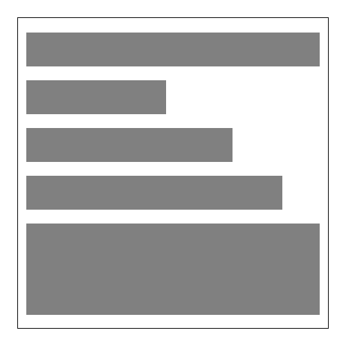
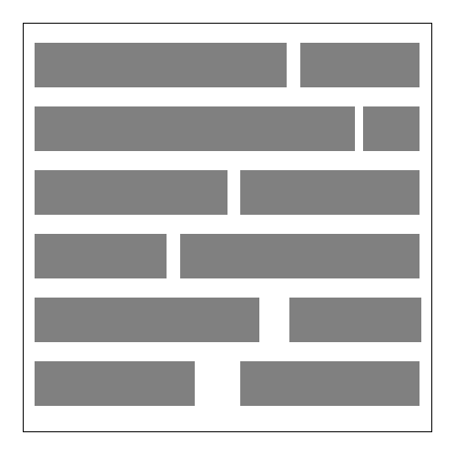

# 第3週：文字與段落

## HTML + CSS 網站架構

---

## 前情提要

文字段落與標題
課堂練習：[前出師表](https://4icsshu.github.io/20250428/20250225-practice.html) 自己撰寫後出師表

---

## 區塊元素vs行內元素

### 區塊元素示意圖



### 行內元素示意圖



---

## 區塊與行內元素規則

### 區塊元素可以包住行內元素

例如：`<p>這是區塊元素可以包住<span>行內元素</span></p>` ✔️

### 行內元素不能包住區塊元素

例如：`<span>這是行內元素不能包住<p>區塊元素</p></span>` ❌

---

## 文字段落區塊大集合

```html
<h1><h1>標題一</h1></h1>
<h2><h2>標題二</h2></h2>
<h3><h3>標題三</h3></h3>
<h4><h4>標題四</h4></h4>
<h5><h5>標題五</h5></h5>
<h6><h6>標題六</h6></h6>
```

```html
<p><p>這是段落</p>
<blockquote cite="https://www.example.com">
<blockquote>這是長引用
</blockquote>
<div><div>容器，無語意。</div>
```

---

## 清單區塊大集合

### ul 無排序清單

```html
<ul>
  <li>清單內容</li>
  <li>清單內容</li>
</ul>
```

### ol 有排序清單

```html
<ol>
  <li>清單內容</li>
  <li>清單內容</li>
</ol>
```

### 清單巢狀結構

```html
<ul>
  <li>清單內容</li>
  <li>清單內容</li>
  <li>
    <ul>
      <li>清單內容</li>
      <li>清單內容</li>
    </ul>
  </li>
</ul>
```

---

## 文字段落行內大集合

```html
<span>跟<div>類似，是一種行內的標籤，無語意</span>
<strong><strong>這是粗體強調</strong></strong>
<em><em>這是斜體，歐文中的另一種強調用法</em></em>
<ins><ins>這是加底線</ins></ins>
<del><del>這是刪除線</del></del>
<code><code>這是程式碼</code></code>
<q><q>短引用</q></q>
```

上標：X`<sup>2</sup>`，下標：H`<sub>2</sub>`O

`<mark>` 這可以拿來作類似螢光筆的效果 `</mark>`

`<abbr title="Hyper Text Markup Language">HTML</abbr>` 可以做到說明縮寫

`<ruby>漢<rt>ㄏㄢˋ</rt>字<rt>ㄗˋ</rt></ruby>` 注音

`<cite>` 這是引用 `</cite>`

---

## Hyper 連結

`<a href="https://ics.wp.shu.edu.tw">這是一個連結</a>`
`<a href="https://4icsshu.github.io/20250428/image.jpg">開啟image.jpg</a>`

### 屬性說明

- `target="_blank"` 另開新頁面
	- `<a href="https://4icsshu.github.io/20250428/image.jpg" target="_blank">以另開新頁面開啟image.jpg</a>`
- `download` 直接下載（某些檔案不適用）
	- `<a href="https://4icsshu.github.io/20250428/image.jpg" download>點了直接下載(image.jpg)</a>`
- `download="abc.jpg"` 直接下載，檔名為後面設定的內容
	- `<a href="https://4icsshu.github.io/20250428/image.jpg" download="abc.jpg">下載成abc.jpg</a>`

### 特殊連結

- `<a href="tel:02-22368225">22358225</a>` - 手機點了就可以撥出
- `<a href="sms:02-22368225">22358225</a>` - 手機點了就可以傳訊息
- `<a href="mailto:seraphwu@gmail.com">seraphwu@gmail.com</a>` - 手機點了就可以寫 e-mail

---

## 圖片

placehold.co 可以快速產生圖片，在網站建構初期可以使用

``

### 連結圖

`<a href="http://ics.wp.shu.edu.tw"></a>`

---

## 路徑的寫法

### 絕對路徑

`https://fonts.googleapis.com/earlyaccess/notosansjapanese.css`

注意：`//fonts.googleapis.com/...` 表示是避免 `http` / `https` 的問題

### 相對路徑

- `/` 從根目錄
- `.` 同層目錄
- `../` 上一層

**注意：** `/` 開頭的連結無法在本機開啟

---

## VS Code Extensions

`Live Server` - 開啟資料夾，按下 Go Live

---

## CSS 三種寫法

### 外連（head 內）

```html
<link rel="stylesheet" type="text/css" href="styles.css">
```

**改一次全站改**，可加上 media 限定媒介/設備

```html
<link rel="stylesheet" type="text/css" href="print.css" media="print">
```
這個僅套用在列印時

### 內嵌（head 內）

```html
<style>
  p {font-size:1rem;}
  span {font-size:10px;color:red;}
</style>
```

**要修改每個 HTML 都得改**

### 行內（元素後）

```html
<p style="color:red;">這段文字都會是紅色</p>
```

**要修改每一行都得改**

---

## 網站的 wireframe


**畫出大致網站佈局**

先拿後面的來作介紹 <https://bootstrap.hexschool.com/docs/4.2/examples/>
