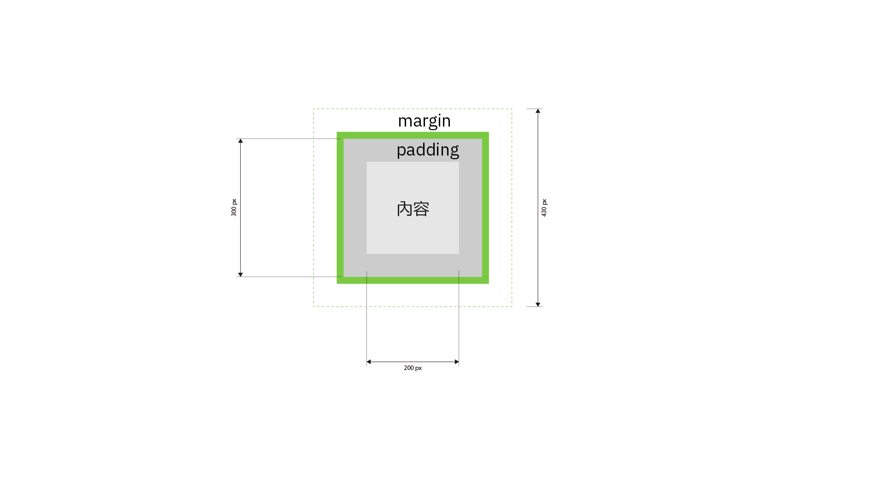

# 第4-5週：CSS 進階與 Box Model

## HTML + CSS / 網站佈局

---

## 超連結 A 元素屬性

```html
<a href="https://ics.wp.shu.edu.tw">這是一個 A 元素</a>
```

```html
<a href="https://seraphwu.github.io/dip/i/dc9a799c-2c08-435f-9033-425853770558.png">這是開啟一個圖片</a>
```
### 常見屬性
<a href="https://seraphwu.github.io/dip/i/dc9a799c-2c08-435f-9033-425853770558.png">開啟圖片</a><br>
`<a href="https://seraphwu.github.io/dip/i/dc9a799c-2c08-435f-9033-425853770558.png">開啟圖片</a>`
- `target="_blank"` 另開新頁面
	- <a href="https://seraphwu.github.io/dip/i/dc9a799c-2c08-435f-9033-425853770558.png" target="_blank">這是以另開新頁面開啟圖片</a>
	- `<a href="https://seraphwu.github.io/dip/i/dc9a799c-2c08-435f-9033-425853770558.png" target="_blank">這是以另開新頁面開啟image.jpg</a>`
- `download` 直接下載（某些檔案不適用）
	- <a href="https://seraphwu.github.io/dip/i/dc9a799c-2c08-435f-9033-425853770558.png" download>變成下載圖片</a>
	- `<a href="https://seraphwu.github.io/dip/i/dc9a799c-2c08-435f-9033-425853770558.png" download>變成下載image.jpg</a>`
- `download="abc.jpg"` 直接下載，檔名為後面設定的內容
	- <a href="https://seraphwu.github.io/dip/i/dc9a799c-2c08-435f-9033-425853770558.png" download="abc.jpg">變成下載成abc.jpg</a>
	- `<a href="https://seraphwu.github.io/dip/i/dc9a799c-2c08-435f-9033-425853770558.png" download="abc.jpg">變成下載成abc.jpg</a>`

### 特殊連結

- `tel:` 電話號碼連結(手機開啟可以撥打電話)
	- <a href="tel:02-22368225">點了可以撥打02-22368225</a>
	- `<a href="tel:02-22368225">點了可以撥打02-22368225</a>`
- `mailto:` 電子郵件連結
	- <a href="mailto:someone@example.com">點了可以寫信到someone@example.com</a>
	- `<a href="mailto:someone@example.com">這是一個 A 元素 指向一個信箱</a>`
- `#id` 錨點連結
	- <a href="#section" id="ancher">這是一個 A 元素 指向一個id="section"</a>
	- `<a href="#section">這是一個 A 元素 指向一個id="section"</a>`

---

## CSS 與連結相關的偽類

1. `:link` (L): 所有（未點擊）連結
2. `:visited` (V): 所有點擊過的連結
3. `:hover` (H): 滑鼠在連結上時的樣子
4. `:active` (A): 啟動的連結
5. `:focus`: 當連結被聚焦的樣子

---

## Box Model



這部分之後再更新

---

## CSS 選擇器語法

**選擇器**，可以是 `HTML 標籤`、`#(id)`、`.(class)`、其他比較複雜的選擇器。

```css
選擇器 {
  屬性: 值;
  屬性: 值;
;}
```

養成好習慣，每一句寫完，都加上 `;`

---

## 常用 CSS 屬性

### width 和 height

寬、高，原先沒有給寬高，所有的元素都會以預設的方式呈現。

```css
p {height: 30px;}
```

後面接的單位有 `%`、`auto`、`px` 等

---

## border 框線

`border` 是框線，由 `border-style`、`border-width`、`border-color`、`border-radius` 構成。

```css
h1 {border: 1px solid red;}
```

代表 h1 元素四周框線 1px，實線、紅色。

---

## border-style 框線樣式

一旦有 `border-style` 就會顯示框線，border-style 一定要在 border-width 前面。

### 四方向樣式

```css
{border-style: dotted dashed double dashed;}
/* 依序是上右下左*/
```

### 單方向指定

- `border-top-style` 上方
- `border-right-style` 右側
- `border-bottom-style` 下方
- `border-left-style` 左側

### 樣式類型

| 值 | 說明 |
| --- | ---- |
| `dotted` | 點狀 |
| `dashed` | 虛線 |
| `solid` | 實線 |
| `double` | 雙線 |
| `groove` | 凹陷浮雕 |
| `ridge` | 凸出浮雕 |
| `inset` | 3D 凹陷 |
| `outset` | 3D 凸出 |
| `none` | 無框線 |
| `hidden` | 隱藏 |

---

## border-width 框線寬度

```css
{border-width: 1px 2px 3px 4px;} /* 依序是上右下左*/
{border-width: 5px 2px;} /* 上下 5px，左右 2px*/
```

### 單方向指定

- `border-top-width` 上方
- `border-right-width` 右側
- `border-bottom-width` 下方
- `border-left-width` 左側

<span id="section">這是剛剛講的</span>**錨點連結** 按<mark><a href="#ancher">這邊</a></mark>則可以回到剛剛超連結 A 元素屬性講錨點連結的地方