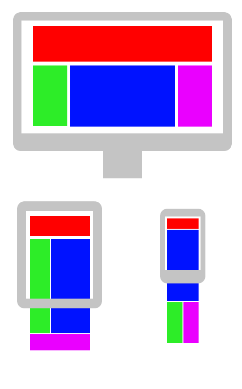
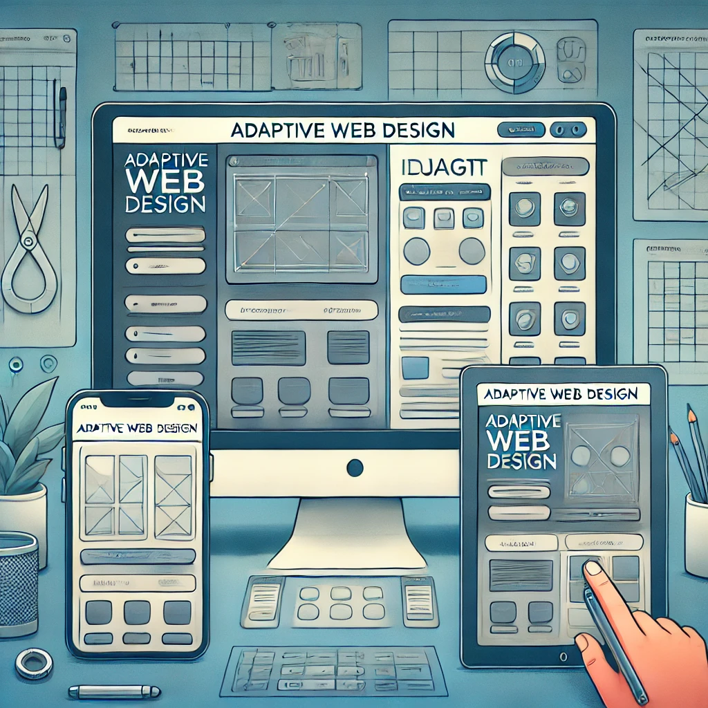

# 第7-8週：RWD 與 Media Query

## 圖片、響應式設計、變數

---

## 圖片

### 傳統寫法

```html

```

### 多解析度圖片

```html
<picture>
  <source srcset="image-large.jpg" media="(min-width: 800px)">
  <source srcset="image-medium.jpg" media="(min-width: 500px)">
  
</picture>
```

---

## RWD 與 AWD

### RWD (Responsive Web Design)



**回應式網頁設計**

- 同一個內容，自動因應不同設備、寬度將網頁版面作變化
- 基於 **media query**
- 只需要更改同樣的內容，就可使全設備、版面都可以變化

### AWD (Adaptive Web Design)



- 自動判斷設備，導入針對不同設備所製作的網頁
- 同時必須針對不同設備進行不同版面設計
- 與 RWD 不同，AWD 為每種設備提供完全不同的網站版本

---

## Media Query

`@media .....`

### 方向偵測

```css
@media (orientation: landscape) { }
@media (orientation: portrait) { }
```

### 寬度偵測

```css
@media (max-width: 768px) { }
@media (min-width: 768px) { }
```

### 實務範例

```css
.navbar {
  display: block;
}
@media (max-width: 768px) {
  .navbar {
    display: none; /* 當螢幕寬度小於 768px 時隱藏導航欄 */
  }
}
```

### 列印媒體

```css
@media print {
  nav {
    display: none; /* 列印時 nav 元素不出現 */
  }
}
```

---

## CSS 變數

`--xxx-xxxxx: <值>;`

```css
--main-color: #0a0a0a;
```

好處：容易維護，可以不用大海撈針改屬性。

### 部分宣告

```css
nav {
  --main-color: #595758;
  background: var(--main-color);
}
section {
  background: var(--main-color);
  /* 無效，因為只在 nav 中宣告，僅適用 nav */
}
```

### 全域宣告

```css
:root {
  --main-color: #FFEEF2;
  --second-color: #FF92C2;
}

nav {
  background: var(--main-color);
}
main {
  background: var(--second-color);
}
```

### 如果變數不存在

```css
:root {
  --main-color: #FFE4F3;
}
main {
  background: var(--main-color);
  color: var(--text-color, black); /* 未宣告變數即用後面 fallback 值 (black) */
}
```

### 變數配合 Media Query

```css
:root {
  --main-color: #E6AA68;
  --secondary-color: #7FB069;
}
nav {
  background: var(--main-color);
}
@media (max-width: 768px) {
  nav {
    background: var(--secondary-color);
  }
}
```

---

## 實務工具

<https://responsively.app/> - 響應式設計測試工具
