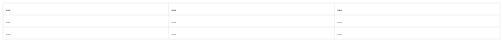
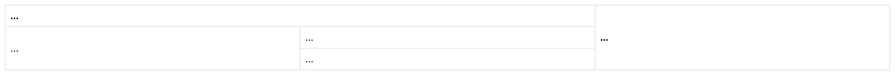
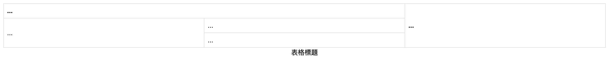
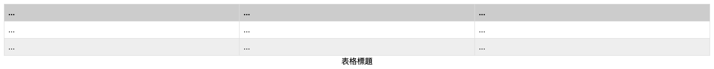

# 第9-10週：表格與表單

## Table 表格設計

---

## `<table>` 元素

### 基本元素

- `<tr>` - table row（表格列）
- `<td>` - table cell（表格儲存格）
- `<th>` - 表格標題（預設粗體）
- `<tr>` 包住 `<td>`、`<th>`

### 最基本的表格

```html
<table>
  <tr>
    <th>....</th><!-- 表格標題，預設粗體 -->
    <th>....</th>
    <th>....</th>
  </tr>
  <tr>
    <td>....</td>
    <td>....</td>
    <td>....</td>
  </tr>
  <tr>
    <td>....</td>
    <td>....</td>
    <td>....</td>
  </tr>
</table>
```


---

## 表格樣式

```css
table {
  width: 100%;
  border-collapse: collapse;
  /* 邊框重疊 | 邊框分離 separate */
}

th, td {
  border: 1px solid #ddd;
  padding: 8px;
  text-align: left;
}
```



---

## 跨列與跨行

- `colspan` - 跨列
- `rowspan` - 跨行

```html
<table>
  <tr>
    <th colspan="2">...</th>
    <th rowspan="3">...</th>
  </tr>
  <tr>
    <td rowspan="2">...</td>
    <td>...</td>
  </tr>
  <tr>
    <td>...</td>
  </tr>
</table>
```



---

## 表格標題 caption

`<caption>` 表格說明，通常在表格元素內第一行

位置可以透過 CSS 中 `caption-side` 調整

```html
<table>
  <caption>表格標題</caption>
  ...
</table>
```

### caption-side

```css
caption {
  caption-side: bottom;
}
```

**通常表格說明會在表格下方**



---

## thead, tbody, tfoot

- `thead` - 表格標題
- `tbody` - 表格內容
- `tfoot` - 表格尾

加上這些元素可以以 CSS 做比較多樣式

```html
<table>
  <caption>表格標題</caption>
  <thead>
    <tr>
      <th>...</th>
      <th>...</th>
      <th>...</th>
    </tr>
  </thead>
  <tbody>
    <tr>
      <td>...</td>
      <td>...</td>
      <td>...</td>
    </tr>
  </tbody>
  <tfoot>
    <tr>
      <td>...</td>
      <td>...</td>
      <td>...</td>
    </tr>
  </tfoot>
</table>
```

### 加上樣式

```css
thead { background: #ccc; }
tfoot { background: #eee; }
```



---

## 其他表格元素

- `col` / `colgroup` - 定義欄的屬性
- `scope="row"` / `scope="col"` - 屬性，用於表頭關聯

---

## 期中考預習

複習重點：

1. HTML 基本標籤結構
2. 區塊與行內元素
3. CSS 選擇器與屬性
4. Box Model
5. Media Query 響應式設計
